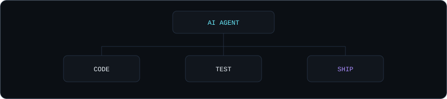
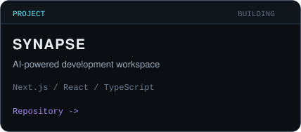
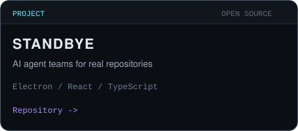
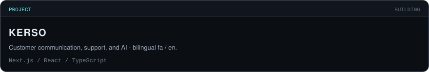

<!--
  GitHub Profile README — Mohammad Saeedi
  Username: mohammadsaeedii

  Visual system: custom SVG in /assets (dark primary, designed light variants).

  Widgets researched before use (Sept 2026):
  - Typing: DenverCoder1/readme-typing-svg → readme-typing-svg.demolab.com (operational)
  - Stats / langs: stats-organization/github-stats-extended → github-stats-extended.vercel.app
    (maintained successor of github-readme-stats; operational)
  - Streak: DenverCoder1/github-readme-streak-stats → streak-stats.demolab.com (operational)
  - Skill icons: tandpfun/skill-icons → skillicons.dev
  - Snake: Platane/snk v3 via .github/workflows/snake.yml → output branch

  Omitted on purpose:
  trophies, 3D graphs, WakaTime (no connected account), visitor badges,
  activity-graph (duplicates the snake), live recent-activity APIs
-->

  <picture>
    <source media="(prefers-color-scheme: dark)" srcset="./assets/hero-dark.svg" />
    <source media="(prefers-color-scheme: light)" srcset="./assets/hero-light.svg" />
    
  </picture>

  <a href="https://github.com/DenverCoder1/readme-typing-svg">
    <picture>
      <source media="(prefers-color-scheme: dark)" srcset="https://readme-typing-svg.demolab.com?font=JetBrains+Mono&amp;weight=500&amp;size=16&amp;duration=3400&amp;pause=1100&amp;color=67E8F9&amp;center=true&amp;vCenter=true&amp;width=520&amp;height=28&amp;lines=Software+Engineer;Full-Stack+Developer;AI+Agent+Builder;Developer+Tools;TypeScript+Systems" />
      <source media="(prefers-color-scheme: light)" srcset="https://readme-typing-svg.demolab.com?font=JetBrains+Mono&amp;weight=500&amp;size=16&amp;duration=3400&amp;pause=1100&amp;color=0F766E&amp;center=true&amp;vCenter=true&amp;width=520&amp;height=28&amp;lines=Software+Engineer;Full-Stack+Developer;AI+Agent+Builder;Developer+Tools;TypeScript+Systems" />
      
    </picture>
  </a>

  

    <a href="https://mohammad-saeedi.vercel.app">Portfolio</a>
    ·
    <a href="https://github.com/mohammadsaeedii">GitHub</a>
    ·
    <a href="https://www.linkedin.com/in/mohammad-saeedi-5ba1a12b7">LinkedIn</a>
    ·
    <a href="mailto:mohammadsaeedi.dev@gmail.com">Email</a>
  

## // ABOUT

Software engineer working across product surfaces, APIs, data, and delivery. Recent work sits at the intersection of **full-stack systems**, **AI agents**, and **developer tools** — architecture that stays explicit, interfaces that stay intentional, and shipping paths that stay boring.

Persian · English · Turkish

## // TERMINAL

  <picture>
    <source media="(prefers-color-scheme: dark)" srcset="./assets/terminal-dark.svg" />
    <source media="(prefers-color-scheme: light)" srcset="./assets/terminal-light.svg" />
    
  </picture>

## // CURRENTLY BUILDING

Agents in the engineering loop: code, test, ship.

  <picture>
    <source media="(prefers-color-scheme: dark)" srcset="./assets/agent-dark.svg" />
    <source media="(prefers-color-scheme: light)" srcset="./assets/agent-light.svg" />
    
  </picture>

| Track | Focus |
| :--- | :--- |
| **AI Agents** | Teams that work inside real repositories |
| **Developer Tools** | Workspaces and local-first agent runtimes |
| **Full-Stack Systems** | TypeScript products from interface to API to Docker |

## // SELECTED WORK

<table>
  <tr>
    <td>
      <a href="https://github.com/mohammadsaeedii/Synaps-editor">
        <picture>
          <source media="(prefers-color-scheme: dark)" srcset="./assets/cards/synapse-dark.svg" />
          <source media="(prefers-color-scheme: light)" srcset="./assets/cards/synapse-light.svg" />
          
        </picture>
      </a>
    </td>
    <td>
      <a href="https://github.com/mirzaaghazadeh/StandBye">
        <picture>
          <source media="(prefers-color-scheme: dark)" srcset="./assets/cards/standbye-dark.svg" />
          <source media="(prefers-color-scheme: light)" srcset="./assets/cards/standbye-light.svg" />
          
        </picture>
      </a>
    </td>
  </tr>
</table>

  <a href="https://github.com/mohammadsaeedii/Kerso-crm">
    <picture>
      <source media="(prefers-color-scheme: dark)" srcset="./assets/cards/kerso-dark.svg" />
      <source media="(prefers-color-scheme: light)" srcset="./assets/cards/kerso-light.svg" />
      
    </picture>
  </a>

## // OPEN SOURCE

Contributing to **[StandBye](https://github.com/mirzaaghazadeh/StandBye)** — a BYOK desktop app where a described team of AI agents works on a repository around the clock.

Recent public work: onboarding / provider selection on the upstream project ([PR #3](https://github.com/mirzaaghazadeh/StandBye/pull/3), [PR #4](https://github.com/mirzaaghazadeh/StandBye/pull/4)).

## // ENGINEERING FOCUS

Architecture · APIs · Data · Auth · DX · AI

Product UIs in React and Next.js. Services in Node.js and NestJS. Data in PostgreSQL and Prisma. Auth that stays maintainable. Delivery with Docker and GitHub Actions.

## // STACK

Technologies from shipped work — grouped, not a wall.

**Frontend**

  <picture>
    <source media="(prefers-color-scheme: dark)" srcset="https://skillicons.dev/icons?i=js,ts,react,nextjs,tailwind&amp;theme=dark" />
    <source media="(prefers-color-scheme: light)" srcset="https://skillicons.dev/icons?i=js,ts,react,nextjs,tailwind&amp;theme=light" />
    
  </picture>

**Backend & data**

  <picture>
    <source media="(prefers-color-scheme: dark)" srcset="https://skillicons.dev/icons?i=nodejs,nestjs,postgres,prisma&amp;theme=dark" />
    <source media="(prefers-color-scheme: light)" srcset="https://skillicons.dev/icons?i=nodejs,nestjs,postgres,prisma&amp;theme=light" />
    
  </picture>

**Infrastructure**

  <picture>
    <source media="(prefers-color-scheme: dark)" srcset="https://skillicons.dev/icons?i=docker,git,linux,githubactions&amp;theme=dark" />
    <source media="(prefers-color-scheme: light)" srcset="https://skillicons.dev/icons?i=docker,git,linux,githubactions&amp;theme=light" />
    
  </picture>

## // GITHUB ACTIVITY

  <table>
    <tr>
      <td>
        <picture>
          <source media="(prefers-color-scheme: dark)" srcset="https://github-stats-extended.vercel.app/api?username=mohammadsaeedii&amp;show_icons=true&amp;hide_border=true&amp;hide_rank=true&amp;hide=stars,issues&amp;disable_animations=true&amp;bg_color=0B0F14&amp;title_color=67E8F9&amp;icon_color=A78BFA&amp;text_color=C9D1D9&amp;ring_color=67E8F9" />
          <source media="(prefers-color-scheme: light)" srcset="https://github-stats-extended.vercel.app/api?username=mohammadsaeedii&amp;show_icons=true&amp;hide_border=true&amp;hide_rank=true&amp;hide=stars,issues&amp;disable_animations=true&amp;bg_color=F7F5F0&amp;title_color=0F766E&amp;icon_color=6D28D9&amp;text_color=3D3A35&amp;ring_color=0F766E" />
          
        </picture>
      </td>
      <td>
        <picture>
          <source media="(prefers-color-scheme: dark)" srcset="https://github-stats-extended.vercel.app/api/top-langs/?username=mohammadsaeedii&amp;layout=compact&amp;langs_count=6&amp;hide_border=true&amp;disable_animations=true&amp;bg_color=0B0F14&amp;title_color=67E8F9&amp;text_color=C9D1D9" />
          <source media="(prefers-color-scheme: light)" srcset="https://github-stats-extended.vercel.app/api/top-langs/?username=mohammadsaeedii&amp;layout=compact&amp;langs_count=6&amp;hide_border=true&amp;disable_animations=true&amp;bg_color=F7F5F0&amp;title_color=0F766E&amp;text_color=3D3A35" />
          
        </picture>
      </td>
    </tr>
  </table>

  <picture>
    <source media="(prefers-color-scheme: dark)" srcset="https://streak-stats.demolab.com?user=mohammadsaeedii&amp;hide_border=true&amp;background=0B0F14&amp;ring=67E8F9&amp;fire=A78BFA&amp;currStreakNum=E6EDF3&amp;sideNums=E6EDF3&amp;currStreakLabel=67E8F9&amp;sideLabels=8B9BB0&amp;dates=8B9BB0&amp;stroke=243041" />
    <source media="(prefers-color-scheme: light)" srcset="https://streak-stats.demolab.com?user=mohammadsaeedii&amp;hide_border=true&amp;background=F7F5F0&amp;ring=0F766E&amp;fire=6D28D9&amp;currStreakNum=1B1F24&amp;sideNums=1B1F24&amp;currStreakLabel=0F766E&amp;sideLabels=6B6458&amp;dates=6B6458&amp;stroke=D8D3C8" />
    
  </picture>

## // CONTRIBUTION GRAPH

Contribution grid rendered as a snake via `Platane/snk`.

  <picture>
    <source media="(prefers-color-scheme: dark)" srcset="https://raw.githubusercontent.com/mohammadsaeedii/mohammadsaeedii/output/github-contribution-grid-snake-dark.svg" />
    <source media="(prefers-color-scheme: light)" srcset="https://raw.githubusercontent.com/mohammadsaeedii/mohammadsaeedii/output/github-contribution-grid-snake.svg" />
    
  </picture>

## // LET'S BUILD

A software engineer who can own a product across the stack — interface, API, data, delivery.

[Portfolio](https://mohammad-saeedi.vercel.app) · [GitHub](https://github.com/mohammadsaeedii) · [LinkedIn](https://www.linkedin.com/in/mohammad-saeedi-5ba1a12b7) · [Email](mailto:mohammadsaeedi.dev@gmail.com) · [Instagram](https://instagram.com/mamadsaeedii)

