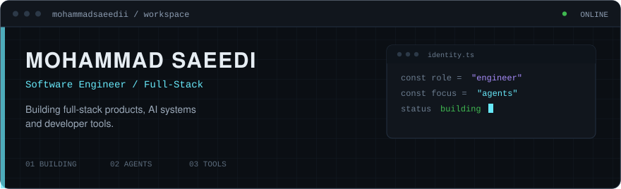
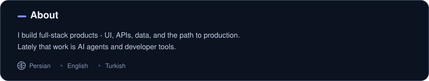
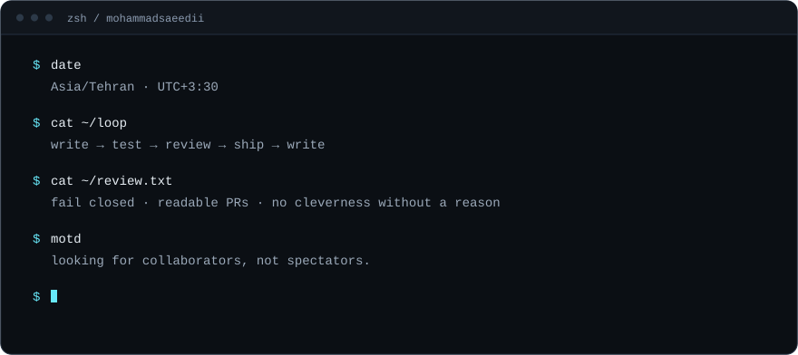

<!--
  GitHub Profile README — Mohammad Saeedi
  Username: mohammadsaeedii

  Visual system: custom SVGs in /assets (navy / indigo dark, cool light).
  Structure: header, hero, about, terminal, stack, GitHub activity.

  Widgets:
  - Skill icons: tandpfun/skill-icons → skillicons.dev
  - Stats / langs: stats-organization/github-stats-extended → github-stats-extended.vercel.app
  - Streak: DenverCoder1/github-readme-streak-stats → streak-stats.demolab.com
  - Chart: ghchart.rshah.org
  - Snake: Platane/snk v3 via .github/workflows/snake.yml → output branch
-->

  <picture>
    <source media="(prefers-color-scheme: dark)" srcset="./assets/header-dark.svg" />
    <source media="(prefers-color-scheme: light)" srcset="./assets/header-light.svg" />
    
  </picture>

  <a href="#home">Home</a>
  ·
  <a href="https://mohammad-saeedi.vercel.app">Projects</a>
  ·
  <a href="https://github.com/mohammadsaeedii">Blog</a>
  ·
  <a href="mailto:mohammadsaeedi.dev@gmail.com">Contact</a>

  <picture>
    <source media="(prefers-color-scheme: dark)" srcset="./assets/hero-dark.svg" />
    <source media="(prefers-color-scheme: light)" srcset="./assets/hero-light.svg" />
    
  </picture>

  <a href="https://mohammad-saeedi.vercel.app">View Portfolio</a>
  ·
  <a href="mailto:mohammadsaeedi.dev@gmail.com">Contact Me</a>
  ·
  <a href="https://github.com/mohammadsaeedii">GitHub</a>
  ·
  <a href="https://www.linkedin.com/in/mohammad-saeedi-5ba1a12b7">LinkedIn</a>
  ·
  <a href="mailto:mohammadsaeedi.dev@gmail.com">Email</a>

  <picture>
    <source media="(prefers-color-scheme: dark)" srcset="./assets/about-dark.svg" />
    <source media="(prefers-color-scheme: light)" srcset="./assets/about-light.svg" />
    
  </picture>

  <picture>
    <source media="(prefers-color-scheme: dark)" srcset="./assets/terminal-dark.svg" />
    <source media="(prefers-color-scheme: light)" srcset="./assets/terminal-light.svg" />
    
  </picture>

  <picture>
    <source media="(prefers-color-scheme: dark)" srcset="./assets/stack-title-dark.svg" />
    <source media="(prefers-color-scheme: light)" srcset="./assets/stack-title-light.svg" />
    
  </picture>

  <picture>
    <source media="(prefers-color-scheme: dark)" srcset="./assets/stack-cols-dark.svg" />
    <source media="(prefers-color-scheme: light)" srcset="./assets/stack-cols-light.svg" />
    
  </picture>

<table align="center" width="880">
  <tr>
    <td align="center" width="220">
      <picture>
        <source media="(prefers-color-scheme: dark)" srcset="https://skillicons.dev/icons?i=react,nextjs,ts,js,tailwind&amp;theme=dark" />
        <source media="(prefers-color-scheme: light)" srcset="https://skillicons.dev/icons?i=react,nextjs,ts,js,tailwind&amp;theme=light" />
        
      </picture>
    </td>
    <td align="center" width="220">
      <picture>
        <source media="(prefers-color-scheme: dark)" srcset="https://skillicons.dev/icons?i=nodejs,nestjs,postgres,prisma&amp;theme=dark" />
        <source media="(prefers-color-scheme: light)" srcset="https://skillicons.dev/icons?i=nodejs,nestjs,postgres,prisma&amp;theme=light" />
        
      </picture>
    </td>
    <td align="center" width="220">
      <picture>
        <source media="(prefers-color-scheme: dark)" srcset="https://skillicons.dev/icons?i=docker,linux,githubactions,vercel&amp;theme=dark" />
        <source media="(prefers-color-scheme: light)" srcset="https://skillicons.dev/icons?i=docker,linux,githubactions,vercel&amp;theme=light" />
        
      </picture>
    </td>
    <td align="center" width="220">
      <picture>
        <source media="(prefers-color-scheme: dark)" srcset="https://skillicons.dev/icons?i=figma,vscode,git,bash&amp;theme=dark" />
        <source media="(prefers-color-scheme: light)" srcset="https://skillicons.dev/icons?i=figma,vscode,git,bash&amp;theme=light" />
        
      </picture>
    </td>
  </tr>
</table>

  <picture>
    <source media="(prefers-color-scheme: dark)" srcset="./assets/activity-title-dark.svg" />
    <source media="(prefers-color-scheme: light)" srcset="./assets/activity-title-light.svg" />
    
  </picture>

  <table>
    <tr>
      <td>
        <picture>
          <source media="(prefers-color-scheme: dark)" srcset="https://github-stats-extended.vercel.app/api?username=mohammadsaeedii&amp;show_icons=true&amp;hide_border=true&amp;hide_rank=true&amp;hide=stars,issues&amp;disable_animations=true&amp;bg_color=0B1220&amp;title_color=818CF8&amp;icon_color=7DD3FC&amp;text_color=C5D0E6&amp;ring_color=818CF8" />
          <source media="(prefers-color-scheme: light)" srcset="https://github-stats-extended.vercel.app/api?username=mohammadsaeedii&amp;show_icons=true&amp;hide_border=true&amp;hide_rank=true&amp;hide=stars,issues&amp;disable_animations=true&amp;bg_color=F4F6FB&amp;title_color=4F46E5&amp;icon_color=0369A1&amp;text_color=334155&amp;ring_color=4F46E5" />
          
        </picture>
      </td>
      <td>
        <picture>
          <source media="(prefers-color-scheme: dark)" srcset="https://github-stats-extended.vercel.app/api/top-langs/?username=mohammadsaeedii&amp;layout=compact&amp;langs_count=6&amp;hide_border=true&amp;disable_animations=true&amp;bg_color=0B1220&amp;title_color=818CF8&amp;text_color=C5D0E6" />
          <source media="(prefers-color-scheme: light)" srcset="https://github-stats-extended.vercel.app/api/top-langs/?username=mohammadsaeedii&amp;layout=compact&amp;langs_count=6&amp;hide_border=true&amp;disable_animations=true&amp;bg_color=F4F6FB&amp;title_color=4F46E5&amp;text_color=334155" />
          
        </picture>
      </td>
    </tr>
  </table>

  <picture>
    <source media="(prefers-color-scheme: dark)" srcset="https://streak-stats.demolab.com?user=mohammadsaeedii&amp;hide_border=true&amp;background=0B1220&amp;ring=818CF8&amp;fire=818CF8&amp;currStreakNum=E8EEF8&amp;sideNums=E8EEF8&amp;currStreakLabel=818CF8&amp;sideLabels=8B9BB8&amp;dates=8B9BB8&amp;stroke=1E2B45" />
    <source media="(prefers-color-scheme: light)" srcset="https://streak-stats.demolab.com?user=mohammadsaeedii&amp;hide_border=true&amp;background=F4F6FB&amp;ring=4F46E5&amp;fire=4F46E5&amp;currStreakNum=0F172A&amp;sideNums=0F172A&amp;currStreakLabel=4F46E5&amp;sideLabels=5B6B85&amp;dates=5B6B85&amp;stroke=D5DCE8" />
    
  </picture>

   

  <picture>
    <source media="(prefers-color-scheme: dark)" srcset="https://ghchart.rshah.org/818CF8/mohammadsaeedii" />
    <source media="(prefers-color-scheme: light)" srcset="https://ghchart.rshah.org/4F46E5/mohammadsaeedii" />
    
  </picture>

   

  <picture>
    <source media="(prefers-color-scheme: dark)" srcset="https://raw.githubusercontent.com/mohammadsaeedii/mohammadsaeedii/output/github-contribution-grid-snake-dark.svg" />
    <source media="(prefers-color-scheme: light)" srcset="https://raw.githubusercontent.com/mohammadsaeedii/mohammadsaeedii/output/github-contribution-grid-snake.svg" />
    
  </picture>

  <picture>
    <source media="(prefers-color-scheme: dark)" srcset="./assets/footer-dark.svg" />
    <source media="(prefers-color-scheme: light)" srcset="./assets/footer-light.svg" />
    
  </picture>

